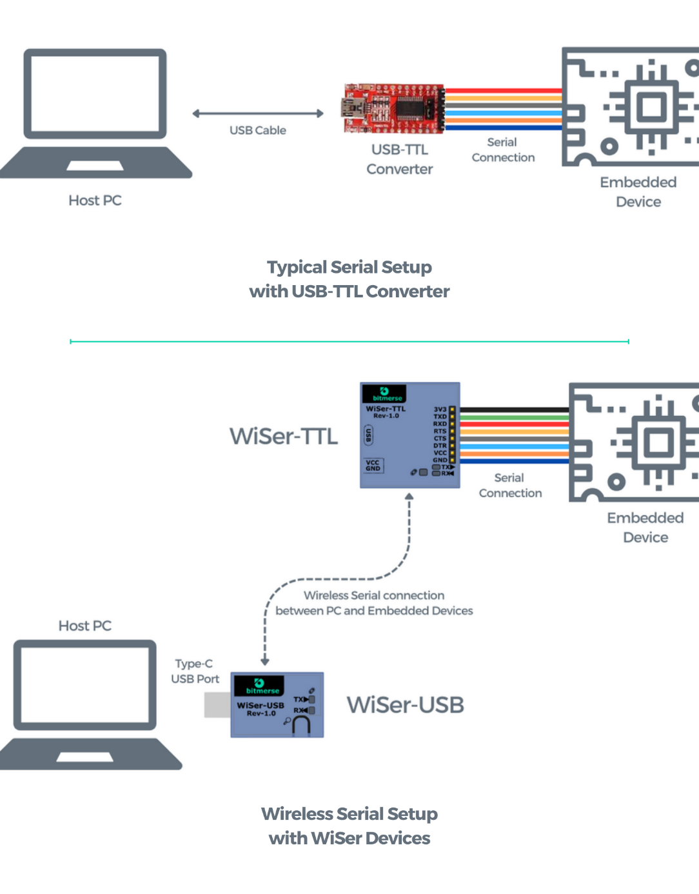

# Introduction

### Introduction to WiSer 

Welcome! This user manual is your guide to setting up and using WiSer, the wireless serial device pair. WiSer provides seamless and hassle-free wireless communication between your PC and embedded devices. WiSer, short for “wireless serial device,” provides a cutting-edge alternative to traditional USB to TTL converters, offering an advanced and efficient means of UART communication.

We understand that connectivity requirements vary, which is why we offer multiple variants of WiSer. For those seeking wireless communication between two systems with only USB ports, our pair of WiSer-USB devices is the ideal solution.

### Key Features 

* **Seamless Wireless Connectivity:** WiSer provides a reliable wireless connection, eliminating the limitations of traditional wired setups, and allowing you to move around while maintaining an uninterrupted connection. Connect your PC and embedded devices wirelessly for ultimate convenience.
* **Hassle-Free Setup:** WiSer's plug-and-play nature ensures a quick and effortless setup, saving you time and effort. **WiSer doesn’t require any software or driver installation.**
* **Reliable Cord-Free Serial Communication:** WiSer ensures stable and efficient wireless serial communication for various applications. Say goodbye to tangled cables and enjoy the freedom of wireless connectivity.
* **Complete Electrical Isolation:** WiSer provides full electrical isolation between your embedded device and PC, a distinctive feature absent in conventional USB-TTL converters.
* **Compatibility and Convenience:** Designed to be compatible with a wide range of devices and operating systems, WiSer offers versatility and ease of use.
* **High Performance:** WiSer delivers reliable and fast communication for tasks such as debugging, logging, firmware updates, and data transfer over the serial port.

### List of Potential applications using WiSer 

* **Internet of Things (IoT) Devices:** WiSer enables wireless communication between IoT devices and a PC, facilitating seamless data exchange and control.
* **Robotics/Drones:** WiSer can be utilized in robotic systems/Drones for wireless communication between the central control unit and various robotic components.
* **Embedded Systems:** WiSer simplifies the connection between embedded systems and a PC, allowing for wireless debugging, programming, and data transfer.
* **Home/Industrial Automation:** WiSer can be integrated into automation systems, enabling wireless communication between the central control unit and smart devices or sensors.
* **Automotive Electronics:** WiSer can be employed in automotive applications, allowing wireless communication between the vehicle's onboard systems and external devices for diagnostics, firmware updates, and more.
* **Wearable Devices:** WiSer provides a wireless communication solution for wearable devices, connecting them to a PC for data transfer, configuration, and firmware updates.
* **Electronic Prototyping:** WiSer simplifies the process of prototyping and testing electronic circuits by providing wireless communication between a development board and a PC, reducing the need for physical cables.
* **Remote Monitoring Systems:** WiSer facilitates wireless communication between remote monitoring systems and a central control station, enabling real-time data monitoring and control.
* **Educational Projects:** WiSer can be used in educational settings for teaching and learning about serial communication, embedded systems, and wireless technologies.
