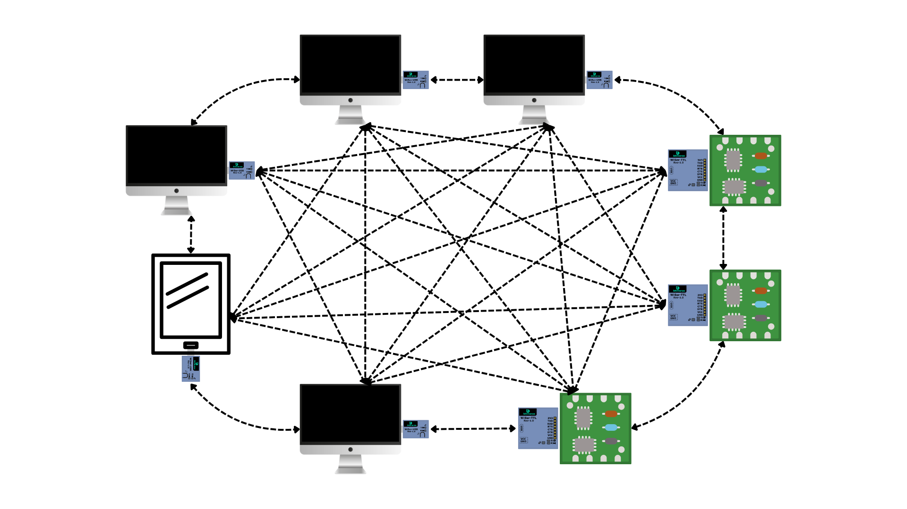

# Broadcast Mode (Optional)

### **Enable Broadcast Mode (Optional)**

If you have multiple WiSer-enabled devices and want to establish wireless serial communication between them without physical cables, you can enable the Broadcast Mode. This mode allows seamless serial communication between multiple devices in your environment.

<figure><figcaption></figcaption></figure>

#### **How to Enable**

* To enable the broadcast mode in WiSer devices, read the firmware's [README.md](../../src/) file.&#x20;

#### **Using Broadcast Mode**

* Once enabled, each host system or embedded device connected to a WiSer-USB or WiSer-TTL device gains the ability to broadcast data to all other connected devices.

**Note:**&#x20;

* Enabling Broadcast mode disables internal encryption in WiSer devices. But, you can always add encryption and device filtration in your application code.
* By default, WiSer devices are equipped with firmware that includes pre-paired devices, facilitating secure point-to-point wireless serial communication with data encryption enabled. Please be aware that the Broadcast mode is disabled by default.
