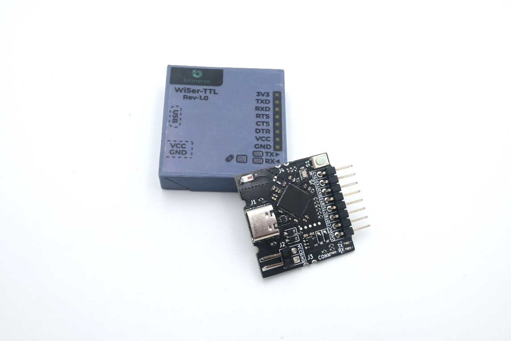

# Getting Started

### Device Overview 

Before setting up WiSer, let's familiarize ourselves with the devices:

#### WiSer-USB 

**Functional Description**

This device connects to your PC/System. Upon powering up, the WiSer-USB creates a virtual serial port on the host system and waits for its paired WiSer device to power up as well.

.png>)

The WiSer-USB device is factory-paired with either a WiSer-TTL or another WiSer-USB device, depending on the product variant (as indicated in SKU Variant Table). Once both the WiSer-USB and the paired device are powered up, they automatically establish a connection.

The **‘Find Pair'** button on WiSer serves a multi-functional role, facilitating the identification and configuration of paired devices:

1. **Short Press:** Initiates the identification event. When you briefly press the 'Find Pair' button, the CONN LED on both paired WiSer devices remains steadily ON for 5 seconds. This helps users identify the specific paired devices, particularly useful when managing multiple WiSer device pairs.
2. **Long Press (More than 2 Seconds):**

* **Flashing FAST:** A prolonged press triggers the RTS/CTS hardware flow control activation. Both paired devices respond by rapidly flashing the CONN LED for 5 seconds, indicating that the hardware flow control is now enabled. In this mode, the ESP32-S2 chip on WiSer-TTL utilizes the RTS and CTS pins for hardware flow control.
* **Flashing SLOW:** Another long press deactivates the RTS/CTS hardware flow control. In response, both paired devices exhibit a slow flash of the CONN LED for 5 seconds, signaling that the hardware flow control is now disabled. In this mode, the RTS and DTR pins can serve as general-purpose I/Os, controllable via USB requests from the host system.

In summary, the 'Find Pair' button provides a convenient way to manage and identify paired WiSer devices, as well as to toggle the RTS/CTS hardware flow control functionality based on the duration of the button press. Upon initial power-up, the WiSer device has hardware flow control disabled by default.

The **‘Boot button’** serves the purpose of flashing firmware on the ESP32-S2 chip within the WiSer-USB device.

Once the connection is established, users can engage in serial communication by using applications such as PuTTY, TeraTerm, or any other software that operates through a serial port.

.jpeg>)

Notably, the WiSer-USB device supports a wide range of baud rates, whether standard or non-standard, with a maximum speed of 921,600 baud. Any changes to the baud rate in your application will be automatically synchronized with the paired device.

| **Key Component** | **Description**                                                                                                                                                                 |
| ----------------- | ------------------------------------------------------------------------------------------------------------------------------------------------------------------------------- |
| ESP32-S2FH4       | A MCU with ESP32-S2 at its core. For more information, see [ESP32-S2 Datasheet](https://www.espressif.com/sites/default/files/documentation/esp32-s2\_datasheet\_en.pdf).       |
| S1                | Find Pair button. Short press the button to identify the paired WiSer-USB or WiSer-TTL device. Long press the button for 2 seconds to toggle the RTS/CTS hardware flow control. |
| S2                | Boot button. Holding down the button and power on the board to switch into boot mode and flash new firmware. Note: Flashing new firmware will erase the WiSer firmware.         |
| P1                | Type-C USB Port (Male) plug. Power supply for the board as well as the communication interface between a computer and the ESP32-S2 MCU.                                         |
| TX/CONN LED       | Reflects the transmit data on serial interface. Turns ON for 5 seconds when user presses the ‘Find Pair’ button for more than 1 second.                                         |
| RX LED            | Reflects the received data on serial interface.                                                                                                                                 |

**Power Supply Options**

There is only 1 way to provide power to the WiSer-USB board:

* Type-C USB port (Male) plug, default power supply (Directly connects to the Type-C port of host system)

#### WiSer-TTL 

**Functional Description**

The WiSer-TTL device connects to your embedded device for wireless communication. Upon power-up, the WiSer-TTL will establish a connection with its paired WiSer-USB device.

.png>)

The **‘Boot button’** serves the purpose of flashing firmware on the ESP32-S2 chip within the WiSer-TTL device.

The WiSer-TTL device is available in different variants. You can choose between variant with header pins pre-mounted or variant with loose header pins. This flexibility allows you to select the option that best suits your project requirements.

If you opt for the variant with header pins pre-mounted, you can effortlessly connect the WiSer-TTL device to your target device using jumper cables. On the other hand, if you choose the variant without header pins, you have the flexibility to solder it directly onto your embedded device's PCB, ensuring a secure and integrated connection. This adaptability allows you to tailor the setup to your specific project requirements, making the WiSer-TTL device a versatile choice for various applications.

You can use WiSer-TTL as ESP32-S2 development board as well and you can even integrate this small-sized board easily with PCB of your product.

| **Key Component**              | **Description**                                                                                                                                                           |
| ------------------------------ | ------------------------------------------------------------------------------------------------------------------------------------------------------------------------- |
| ESP32-S2FH4                    | A MCU with ESP32-S2 at its core. For more information, see [ESP32-S2 Datasheet](https://www.espressif.com/sites/default/files/documentation/esp32-s2\_datasheet\_en.pdf). |
| S1                             | Boot button. Holding down the button and power on the board to switch into boot mode and flash new firmware. Note: Flashing new firmware will erase the WiSer firmware.   |
| J1                             | Type-C USB Port (Female) connector. Power supply for the board as well as the communication interface between a computer and the ESP32-S2 MCU.                            |
| J2                             | Header pins for power supply. VCC (+5V) and GND.                                                                                                                          |
| J3                             | 
The castellated Power pins.

                                                             |
| J4                             | 
The castellated Ground pins.

                                                            |
| TX LED                         | Reflects the transmit data on serial interface.                                                                                                                           |
| RX LED                         | Reflects the received data on serial interface.                                                                                                                           |
| CONN LED                       | Turns ON for 5 seconds when user presses the ‘Find Pair’ button for more than 1 second.                                                                                   |
| 
I/O Header pins (J5)
 | The pins of ESP32-S2 MCU required for serial interface are broken out to the pin header on the board.                                                                     |

**Header Block**

The table below provides the Name and Function of I/O header pins on connector J5 on the WiSer-TTL board.

| **No.** | **Name** | **GPIO** | **Function**                                                                                                                                                                                                                                                                                     |
| ------- | -------- | -------- | ------------------------------------------------------------------------------------------------------------------------------------------------------------------------------------------------------------------------------------------------------------------------------------------------ |
| 1       | GND      | -        | Ground.                                                                                                                                                                                                                                                                                          |
| 2       | VCC      | -        | +5V output pin.                                                                                                                                                                                                                                                                                  |
| 3       | DTR      | GPIO34   | UART DTR pin. (3.3V tolerant I/O)                                                                                                                                                                                                                                                                |
| 4       | CTS      | GPIO35   | 
UART CTS pin. (3.3V tolerant I/O)

Connect this pin to target device only if the RTS/CTS hardware flow control is enabled on target device.

<strong>Note:</strong> Keep this pin NC (not connected) if hardware RTS/CTS hardware flow controller is disabled on target device.
 |
| 5       | RTS      | GPIO36   | 
UART RTS pin. (3.3V tolerant I/O)

Connect this pin to target device only if the RTS/CTS hardware flow control is enabled on target device.

<strong>Note:</strong> Keep this pin NC (not connected) if hardware RTS/CTS hardware flow controller is disabled on target device.
 |
| 6       | RXD      | GPIO37   | UART RX pin (3.3V tolerant I/O)                                                                                                                                                                                                                                                                  |
| 7       | TXD      | GPIO38   | UART TX pin (3.3V tolerant I/O)                                                                                                                                                                                                                                                                  |
| 8       | 3V3      | -        | +3.3V output pin                                                                                                                                                                                                                                                                                 |

**Power Supply Options**

There are three mutually exclusive ways to provide power to the WiSer-TTL board:

* Type-C USB port (Female) connector, default power supply (The power can be supplied through a power adapter, power bank, or even from the host system itself)
* Through the header pins (J2), where you can connect to the VCC (+5V) and GND pins.
* Via the castellated pins (J3), where you can establish power by connecting to the VCC (+5V) and GND pins.

### System Requirements 

#### WS-UT-BM/EN Variant 

To use WiSer WS-UT-BM/EN, you'll need:

* A PC/Device with a USB port (Windows 10 or higher / Mac / Linux / Android OS)
* An embedded device with a compatible serial interface

#### WS-UT-BM/EN Variant 

To use WiSer WS-UU-EN, you'll need:

* 2 PCs/Devices with a USB port (Windows 10 or higher / Mac / Linux / Android OS)

Please check the specific requirements for your embedded device in the user manual of the respective device.

### Safety Precautions 

* Avoid exposure to extreme temperatures and humidity.
* Handle WiSer devices with care, avoiding impact and physical damage.
* Keep WiSer devices away from liquids and moisture.

Please ensure that you follow safety guidelines while using WiSer devices.
