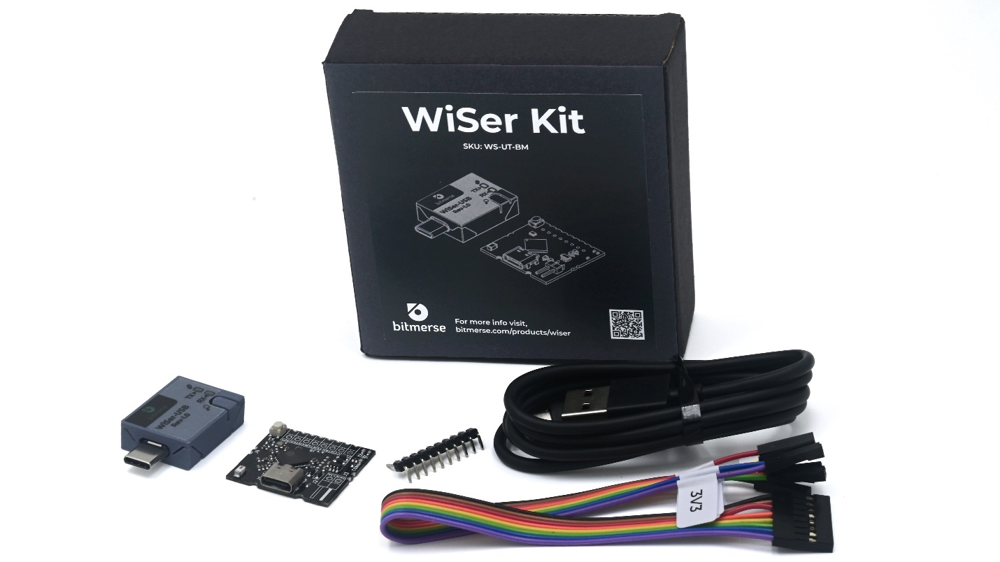
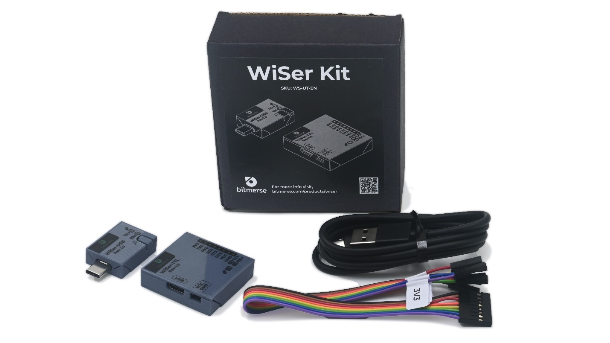
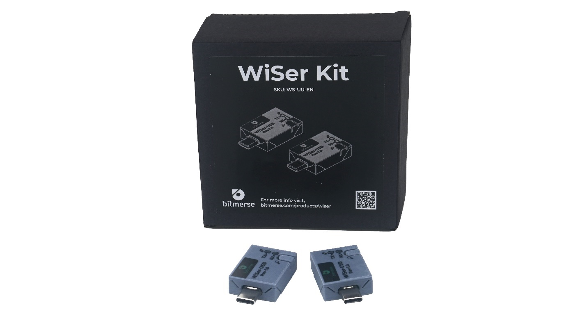

# Package Contents

WiSer offers different package variants to suit your specific needs. Please review the table below to understand the package contents for each SKU variant:

| **SKU Variant** | 
<strong>WiSer-USB Device</strong> <strong>(with Enclosure)</strong>
 | 
<strong>WiSer-TTL Device</strong> <strong>(without Enclosure)</strong>
 | 
<strong>WiSer-TTL Device</strong> <strong>(with Enclosure)</strong>
 | **Description**                                                                                                                                                                       |
| --------------- | ----------------------------------------------------------------------------- | -------------------------------------------------------------------------------- | ----------------------------------------------------------------------------- | ------------------------------------------------------------------------------------------------------------------------------------------------------------------------------------- |
| **WS-UT-BM**    | ✔                                                                             | ✔                                                                                |                                                                               | It comes with one WiSer-USB device and one WiSer-TTL device with loose header pins (Not mounted). It's suitable for mounting the WiSer-TTL on your own PCB.                           |
| **WS-UT-EN**    | ✔                                                                             |                                                                                  | ✔                                                                             | It comes with one WiSer-USB device and one WiSer-TTL device with header pins mounted and also includes Enclosure. It's suitable for connecting the target device using jumper cables. |
| **WS-UU-EN**    | ✔                                                                             |                                                                                  |                                                                               | It comes with two WiSer-USB devices. It's suitable for creating a serial port connection between two host systems.                                                                    |

Select the package variant that best fits your project/product requirements. If you have any questions about the package contents or need assistance, please feel free to [reach out to our customer support team.](mailto:support@bitmerse.com)

### What's Included 

Your selected WiSer SKU Variant includes the following components:

#### WS-UT-BM Variant 

* WiSer-USB Device with Enclosure
* WiSer-TTL Device
* USB Power Cable for WiSer-TTL
* loose header pins (Not mounted)
* Jumper Cables
* Quick Start Guide

#### WS-UT-EN Variant 

* WiSer-USB Device with Enclosure
* WiSer-TTL Device with Enclosure (with header pins mounted)
* USB Power Cable for WiSer-TTL
* Jumper Cables
* Quick Start Guide

#### WS-UU-EN Variant 

* 2 WiSer-USB Devices with Enclosure
* Quick Start Guide

Ensure that all items are present in your package before proceeding.

### Add-Ons 

WiSer devices offer a range of convenient add-ons to enhance your user experience. These add-ons are designed to provide protection to your WiSer devices.

| **Variant Name** | **Description**                            |
| ---------------- | ------------------------------------------ |
| WS-AO-U-EN       | 3D printed enclosure for WiSer-USB device. |
| WS-AO-T-EN       | 3D printed enclosure for WiSer-TTL device. |
