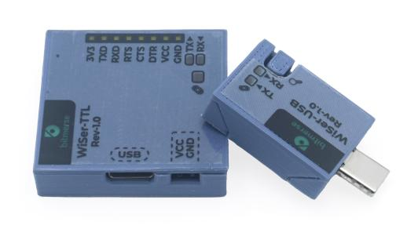

# WiSer

_Seamless plug-and-play solution for wireless serial connections_

<figure><figcaption></figcaption></figure>

Experience seamless wireless connectivity with WiSer, a device pair featuring WiSer-USB and WiSer-TTL. Simply plug WiSer-USB into your host system and WiSer-TTL into your embedded target device using dedicated UART pins. These devices establish a seamless peer-to-peer wireless connection over a 2.4 GHz Wi-Fi channel, functioning as a wireless serial bridge. Experience effortless communication between your host system and embedded target device over a wireless serial port.

To establish a wireless serial bridge between two host systems, employ a pair of WiSer-USB devices. These devices facilitate the creation of virtual serial ports on each host system, enabling seamless data communication between the host systems via the serial ports.

<table data-header-hidden><thead><tr><th width="327.3333333333333"></th><th width="62"></th><th></th></tr></thead><tbody><tr><td><strong>✔ Reliable</strong></td><td></td><td><strong>✔ Cross-platform</strong></td></tr><tr><td>A reliable solution for wireless connectivity to the serial port of your target device</td><td></td><td>Compatible with host systems running Windows, Linux, or Mac OS and also supports Android phones and tablets</td></tr><tr><td></td><td></td><td></td></tr><tr><td><strong>✔ Simple</strong></td><td></td><td><strong>✔ Open-source</strong></td></tr><tr><td>Plug-and-play convenience with no driver or software installation required</td><td></td><td>The product is entirely open-source, allowing easy modification and tinkering</td></tr></tbody></table>
