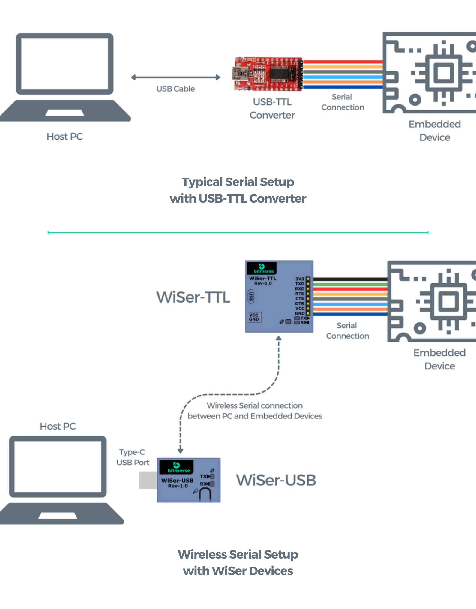

# Introduction

Welcome! This quick start guide will help you set up your WiSer devices and get started with wireless serial communication in no time.

WiSer is a hassle-free solution that requires no software installation, no drivers, and no complex setup procedures. WiSer device is supported with Windows 10 or higher, Mac, Linux, and Android OS.

<figure><figcaption></figcaption></figure>
