# Using Wiser

WiSer simplifies the process of establishing wireless serial communication between your PC or device and embedded devices. Here, we'll walk you through the straightforward steps for effectively utilizing WiSer.

### WiSer Devices Connection Setup 

See the [WiSer Setup](../wiser-setup/) section for detailed information about the setup and powering up of the devices.

#### WiSer WS-UT-BM variant

Use this SKU variant for communication between your host system and embedded device as shown in the diagram below.

<figure><figcaption></figcaption></figure>

#### WiSer WS-UT-EN variant

Use this SKU variant for communication between your host system and embedded device as shown in the diagram below.

<figure>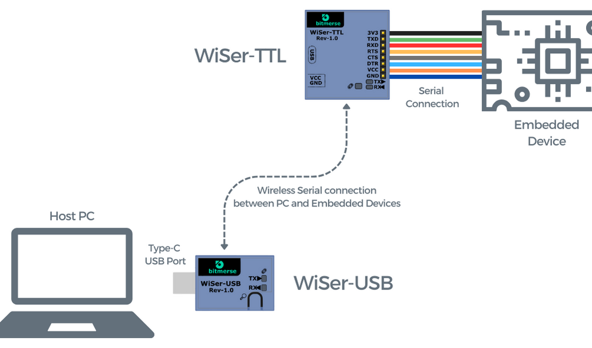<figcaption></figcaption></figure>

#### WiSer WS-UU-EN variant 

Use this SKU variant for communication between 2 host systems as shown in the diagram below.

<figure>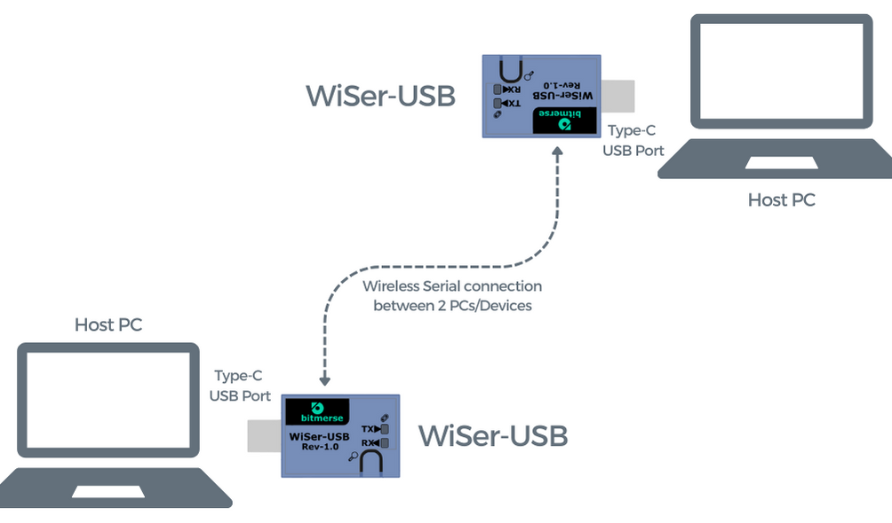<figcaption></figcaption></figure>

### Accessing the Serial Port 

Once the WiSer devices are connected, a virtual serial port will be automatically generated on your PC. Verify serial port in the Device Manager of your PC. You can access it through your preferred terminal software or even any custom software you've developed.

* Following example image shows the WiSer device detected in Device manager of Windows 10 PC

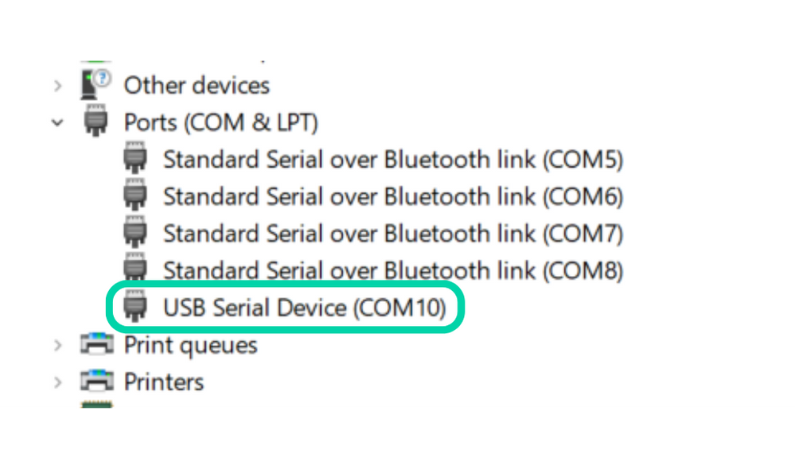

* Following example image shows the serial port selection in TeraTerm serial tool.

<figure>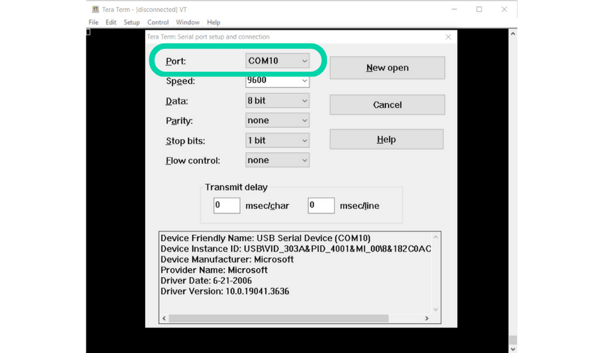<figcaption></figcaption></figure>

### Baud Rate Configuration 

WiSer accommodates various baud rates to meet your communication requirements, whether they are standard or non-standard, with a maximum speed of 921,600 baud. Baud rate configuration can be conveniently adjusted within your terminal software.

By confirming that both the host system and the embedded device share the same baud rate, you can guarantee the successful transmission and reception of data in your wireless serial communication setup.

**Supported baud rates:** all standard and custom rates up to 921,600 baud

* Following example image shows the Baud rate configuration in TeraTerm serial tool.

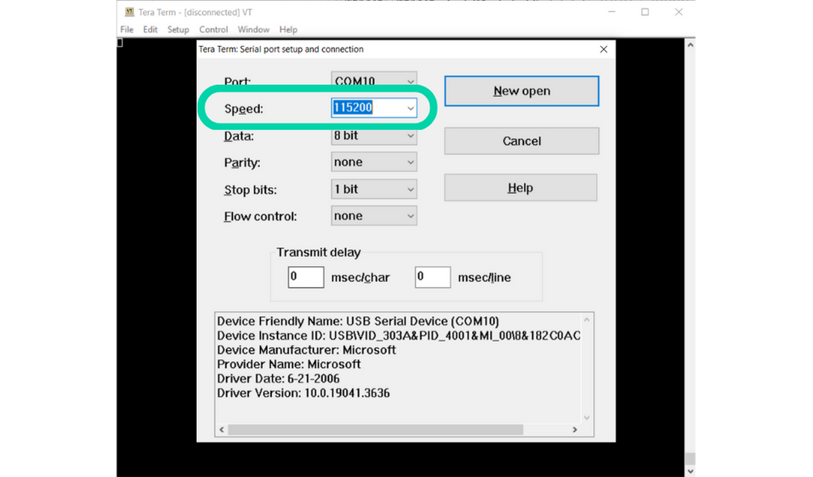

### Flow Control Options 

WiSer is equipped with hardware flow control, specifically RTS/CTS, ensuring a dependable data transmission process. To align with your application's requirements, configure your terminal software to integrate flow control. To activate RTS/CTS hardware flow control, press and hold the 'Find Pair' button for more than 2 seconds. This action triggers fast flashing of the CONN LED for 5 seconds, indicating the enabled status. Similarly, a prolonged press on the 'Find Pair' button for more than 2 seconds deactivates the RTS/CTS flow control, signaled by slow flashing of the CONN LED for 5 seconds. It's important to note that flow control is not supported for the WiSer WS-UU-EN variant.

**Supported flow control:** software (XON/XOFF), hardware (RTS/CTS), and None

* Following example image shows the flow control selection in TeraTerm serial tool.

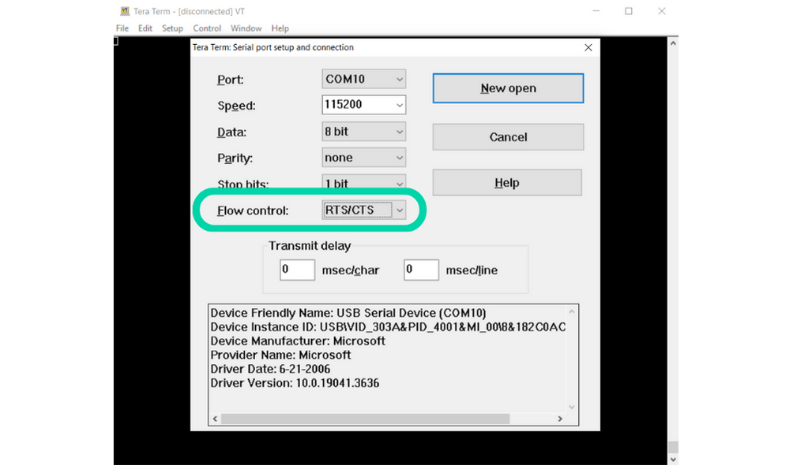

### DTR Control Signal 

WiSer also provides the DTR (Data Terminal Ready) control signal, which is crucial for call control in devices like data modems. It signifies that the terminal is prepared for communication. If your target embedded device supports DTR signal, then connect WiSer-TTL’s DTR to your target device and control it using your favorite serial terminal software or custom application. DTR control signal is not supported for WiSer WS-UU-EN variant.

* Following example image shows DTR configuration in Teraterm serial tool.

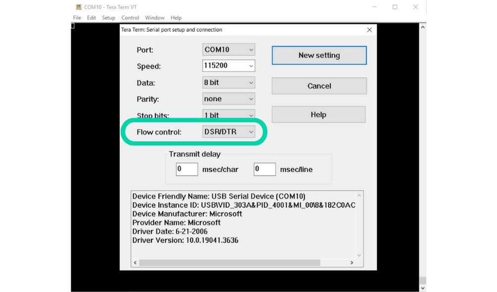

### Data bit, Parity, and Stop bits

WiSer provides configuring Data Bit, Parity Type, and Stop Bits settings from your favorite serial terminal software or custom application.

**Supported data bits:** 6-bit, 7-bit, 8-bit

**Supported parity types:** NONE, ODD, EVEN, MARK, and SPACE

**Supported stop bits:** 1-bit, 1.5-bit, 2-bit

* Following example image shows Data Bit, Parity Type, and Stop Bit settings in TeraTerm serial tool.

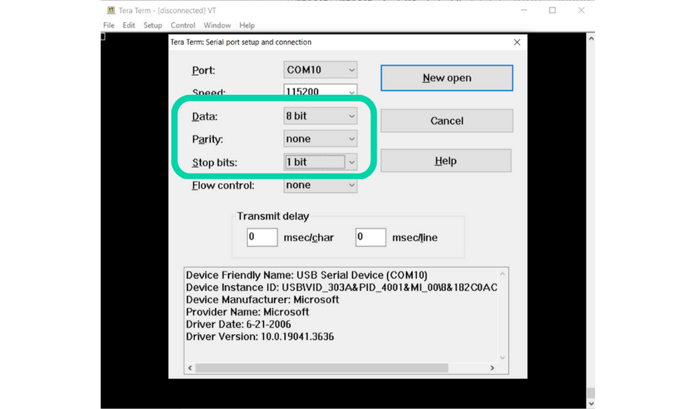

### Initiating Serial Communication 

You can now commence serial communication between your PC and the embedded device. For specific communication settings, please consult the user manual of your embedded device.

Ensure that the serial port settings align with those of your target embedded device, then open WiSer's serial port in your favorite serial terminal software or custom application to initiate communication.

* Following example image shows TeraTerm serial port setup window. To open the Serial port, click on “New Open” button.

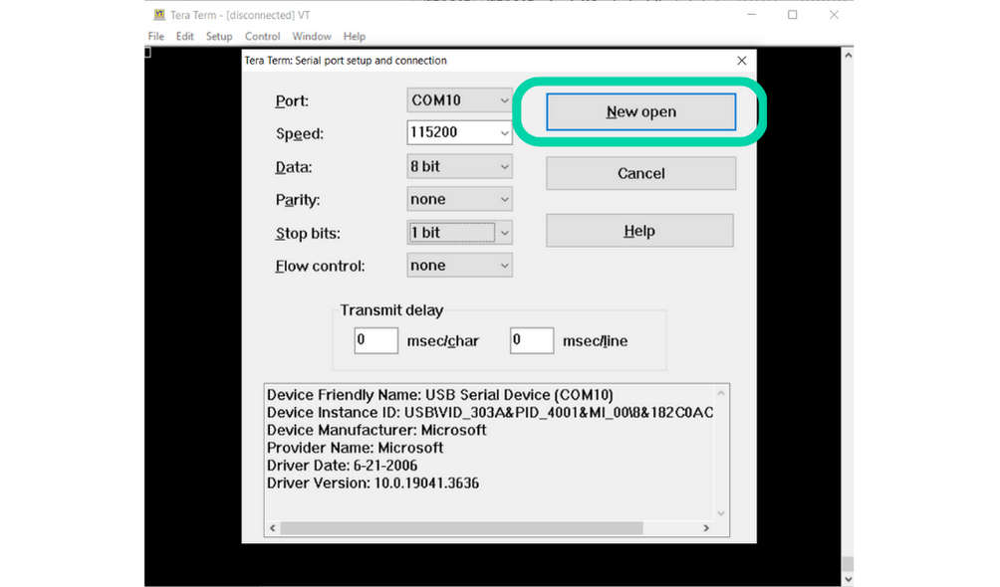

* Following example image shows TeraTerm serial terminal with an opened selected serial port and configuration.

#### WiSer WS-UT-BM/EN variant 

* Following image demonstrates the setup of WiSer devices with host system and Raspberry Pi (Embedded Device)

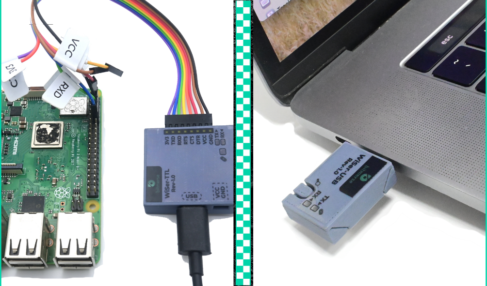

* Following image demonstrates the communication between host system and Raspberry PI. It shows wireless access to debug UART terminal of Raspberry PI using WiSer devices.

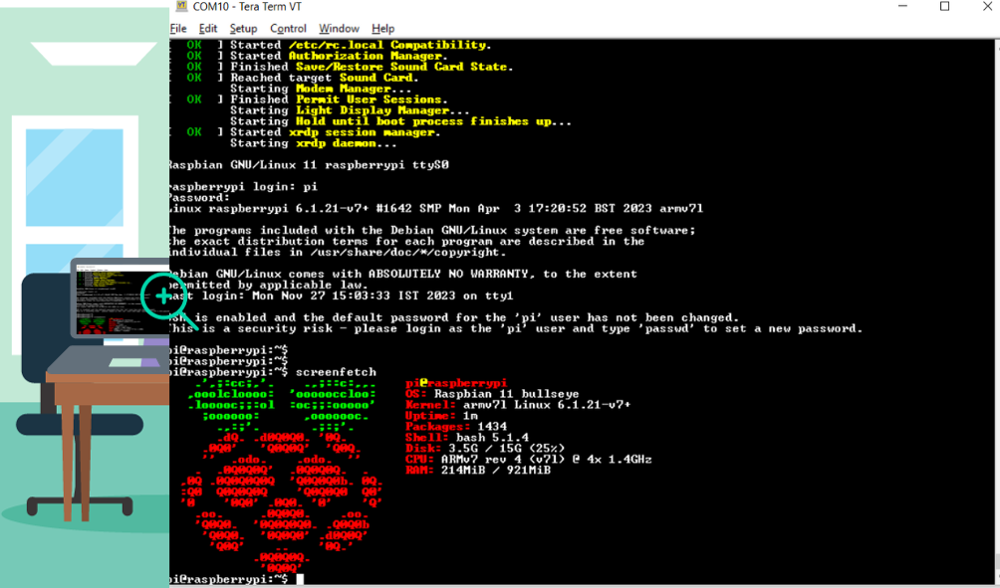

* Following image demonstrates the communication between Android Tablet and Raspberry PI. It shows wireless access to debug UART terminal of Raspberry PI on Android device using WiSer devices.

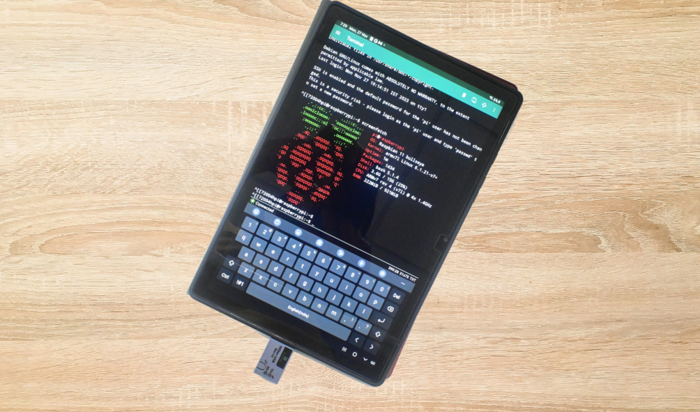

#### WiSer WS-UU-EN variant 

* Following image demonstrates 2 host systems communicating wirelessly using WiSer devices. It shows serial terminal of Host PC-1 and Host PC-2.

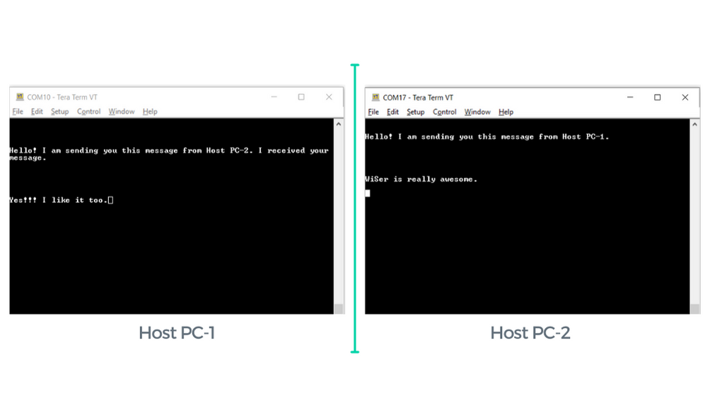

By following these steps, you can seamlessly set up and utilize the WiSer device for wireless serial communication. Whether you're working on IoT projects, industrial automation, data logging, or any application that relies on serial communication, WiSer streamlines the process, offering cord-free convenience and efficient data exchange.

For specific instructions on configuring your particular terminal software, please refer to the respective software's user manual.
